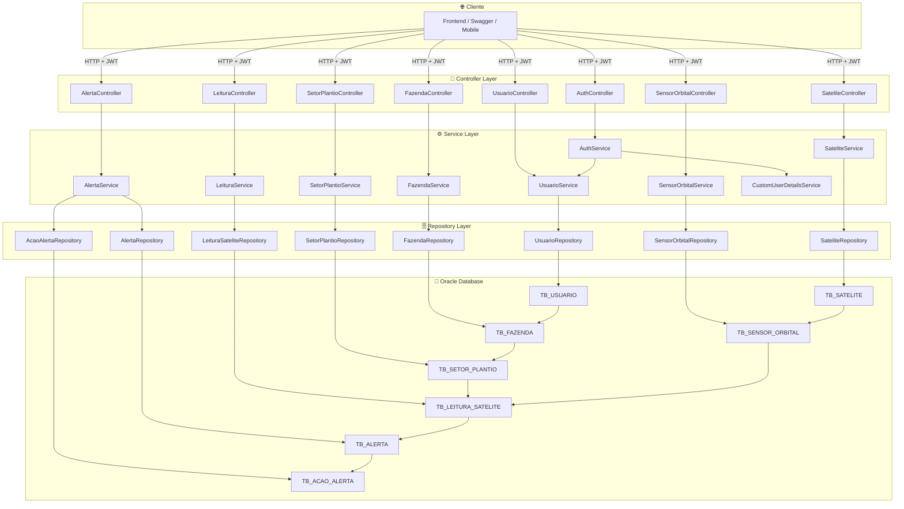
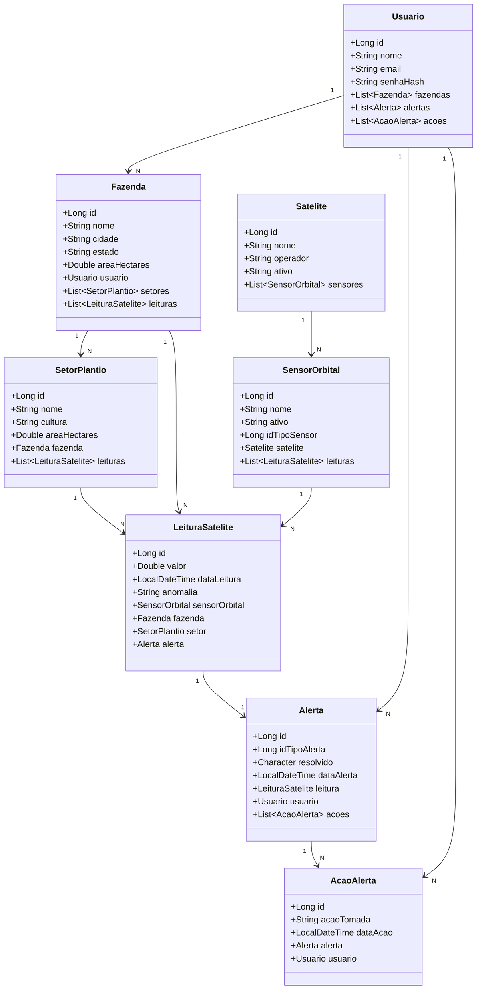

# 🌾🛰️ SpaceCrop API
 
> **Global Solution 2026/1 — FIAP | Java Advanced**  
> Monitoramento agrícola inteligente via dados satelitais
 
---
 
## 📋 Descrição
 
A **SpaceCrop** é uma API REST desenvolvida em Java com Spring Boot que conecta a exploração espacial ao agronegócio brasileiro. A plataforma recebe leituras de sensores orbitais embarcados em satélites e as transforma em alertas acionáveis para produtores rurais — ajudando a otimizar safras, prevenir perdas e monitorar setores de plantio em tempo real.
 
O projeto integra o tema da **Global Solution 2026/1 da FIAP**, que propõe soluções inovadoras dentro da economia espacial, com foco no ODS 2 (Fome Zero e Agricultura Sustentável) e ODS 13 (Ação Climática).
 
---
 
## 👥 Integrantes
 
| Nome | RM |
|---|---|
| Lucas Grillo Alcântara | 561413 |
| Pietro Ferreira Gomes Abrahamian | 561469 |
| Pedro Peres Benitez | 561792 |
| Lucca Ramos Mussumecci | 562027 |
 
---
 
## 🔗 Links
 
| Recurso | Link |
|---|---|
| 📦 Repositório GitHub | `https://github.com/lgaxd/spacecrop-api-java` |
| 🎬 Vídeo de Apresentação | `https://www.youtube.com/watch?v=NuVu6FBMNN8` |
| 🎯 Vídeo Pitch | `https://www.youtube.com/watch?v=gjCMcwhsAEs` |
| 📖 Documentação Swagger | `http://68.211.88.151:8080/swagger` |
| 📄 OpenAPI Spec | `http://68.211.88.151:8080/api-docs` |
| 🚀 Deploy | `http://68.211.88.151:8080` |
 
---
 
## 🏗️ Arquitetura
 
A API segue uma arquitetura em camadas bem definida:
 
```
Controller → Service → Repository → Entity (Oracle DB)
```
 
Cada camada tem responsabilidade única, com comunicação via DTOs entre Controller e Service, garantindo separação entre a representação externa e o modelo de dados interno.
 
```
src/main/java/br/com/fiap/spacecrop/
├── config/          # Segurança (JWT, CORS, Swagger, Cache)
├── controller/      # Endpoints REST (HATEOAS)
├── dto/
│   ├── request/     # Payloads de entrada com validação
│   └── response/    # Payloads de saída
├── entity/          # Entidades JPA (mapeamento Oracle)
├── exception/       # Tratamento global de erros
├── repository/      # Acesso a dados (JpaRepository)
└── service/         # Regras de negócio
```
 
### Modelo de Dados
 
```
Usuario
  └─── Fazenda (1:N)
         └─── SetorPlantio (1:N)
                └─── LeituraSatelite (N:N via SensorOrbital)
                       └─── Alerta (1:N)
                              └─── AcaoAlerta (1:N)
 
Satelite
  └─── SensorOrbital (1:N)
         └─── LeituraSatelite (1:N)
```
 
---
 
## 🛠️ Tecnologias
 
| Tecnologia | Versão | Uso |
|---|---|---|
| Java | 21 | Linguagem principal |
| Spring Boot | 4.0.6 | Framework base |
| Spring Security + JWT | — | Autenticação/Autorização |
| Spring Data JPA | — | Persistência ORM |
| Spring HATEOAS | — | Hipermídia nos responses |
| Spring Validation | — | Validação de entrada |
| Spring Cache | — | Cache em memória |
| Oracle Database | OJDBC 11 | Banco de dados relacional |
| SpringDoc OpenAPI | 3.0.2 | Documentação Swagger |
| Lombok | — | Redução de boilerplate |
| Maven | 3.9.16 | Build e dependências |
 
---

## 🚀 Como Testar (Na Nuvem)

Acesse o link `http://68.211.88.151:8080/swagger` para explorar e testar todos os endpoints interativamente.

---

## 🚀 Como Executar (localmente)
 
### Pré-requisitos
 
- Java 21+
- Maven 3.9+
- Oracle Database (ou acesso a instância remota)

### 1. Clone o repositório
 
```bash
git clone https://github.com/lgaxd/spacecrop-api-java.git
cd spacecrop-api-java
```

### 2. Crie o banco de dados Oracle com o código SQL incluso no projeto
 
### 3. Configure as variáveis de ambiente
 
Crie um arquivo `.env` ou configure as variáveis diretamente no sistema:
 
```bash
export DATABASE_URL=jdbc:oracle:thin:@<host>:<port>/<service>
export DATABASE_USERNAME=seu_usuario
export DATABASE_PASSWORD=sua_senha
export JWT_SECRET=sua_chave_secreta_com_minimo_32_caracteres
export JWT_EXPIRATION=86400000   # 24h em milissegundos (opcional)
```

> ⚠️ O `JWT_SECRET` deve ter no mínimo 32 caracteres para funcionar corretamente com HS256.

### 4. Execute a aplicação
 
```bash
./mvnw spring-boot:run
```
 
A API estará disponível em `http://localhost:8080`.
 
### 5. Acesse a documentação
 
Abra o navegador em `http://localhost:8080/swagger` para explorar e testar todos os endpoints interativamente.
 
---
 
## 🔐 Autenticação
 
A API utiliza **JWT (Bearer Token)** com Spring Security. Todos os endpoints exigem autenticação, exceto `/auth/**` e a documentação Swagger.
 
**Fluxo:**
 
```
POST /auth/register  →  Cria conta
POST /auth/login     →  Retorna { "token": "eyJ..." }
 
# Use o token nas próximas requisições:
Authorization: Bearer eyJ...
```
 
### Exemplo — Registro e Login
 
```bash
# 1. Registrar
curl -X POST http://localhost:8080/auth/register \
  -H "Content-Type: application/json" \
  -d '{"nome": "João Silva", "email": "joao@email.com", "senha": "senha123"}'
 
# 2. Login
curl -X POST http://localhost:8080/auth/login \
  -H "Content-Type: application/json" \
  -d '{"email": "joao@email.com", "senha": "senha123"}'
 
# Resposta:
# { "token": "eyJhbGciOiJIUzI1NiJ9..." }
```
 
---
 
## 📡 Endpoints
 
### Auth
| Método | Endpoint | Descrição | Auth |
|---|---|---|---|
| POST | `/auth/register` | Cadastrar usuário | ❌ |
| POST | `/auth/login` | Autenticar e obter token | ❌ |
 
### Usuários
| Método | Endpoint | Descrição |
|---|---|---|
| GET | `/usuarios` | Listar usuários (paginado, filtros: nome, email) |
| GET | `/usuarios/{id}` | Buscar usuário por ID |
| PUT | `/usuarios/{id}` | Atualizar usuário |
| DELETE | `/usuarios/{id}` | Remover usuário |
 
### Fazendas
| Método | Endpoint | Descrição |
|---|---|---|
| GET | `/fazendas` | Listar fazendas do usuário autenticado |
| GET | `/fazendas/todas` | Listar todas as fazendas |
| GET | `/fazendas/{id}` | Buscar fazenda por ID |
| POST | `/fazendas` | Cadastrar fazenda |
| PUT | `/fazendas/{id}` | Atualizar fazenda |
| DELETE | `/fazendas/{id}` | Remover fazenda |
 
### Setores de Plantio
| Método | Endpoint | Descrição |
|---|---|---|
| GET | `/setores` | Listar setores |
| GET | `/setores/{id}` | Buscar setor por ID |
| POST | `/setores` | Cadastrar setor |
| PUT | `/setores/{id}` | Atualizar setor |
| DELETE | `/setores/{id}` | Remover setor |
 
### Satélites & Sensores Orbitais
| Método | Endpoint | Descrição |
|---|---|---|
| GET | `/satelites` | Listar satélites |
| GET | `/satelites/{id}` | Buscar satélite |
| GET | `/sensores-orbitais` | Listar sensores orbitais |
| GET | `/sensores-orbitais/{id}` | Buscar sensor orbital |
 
### Leituras
| Método | Endpoint | Descrição |
|---|---|---|
| GET | `/leituras` | Listar leituras satelitais |
| GET | `/leituras/{id}` | Buscar leitura por ID |
| POST | `/leituras` | Registrar leitura de sensor |
| DELETE | `/leituras/{id}` | Remover leitura |
 
### Alertas
| Método | Endpoint | Descrição |
|---|---|---|
| GET | `/alertas` | Listar alertas do usuário |
| GET | `/alertas/{id}` | Buscar alerta por ID |
| POST | `/alertas/{id}/resolver` | Marcar alerta como resolvido |
| DELETE | `/alertas/{id}` | Remover alerta |
 
> 📖 A documentação completa com schemas, exemplos de request/response e possibilidade de teste está disponível no Swagger: `GET /swagger`
 
---
 
## ⚙️ Funcionalidades Técnicas
 
- **HATEOAS** — Responses incluem links de navegação hipermídia
- **Paginação** — Endpoints de listagem suportam `?page=0&size=10&sort=nome,asc`
- **Filtros** — Parâmetros de query para filtragem (ex: `?nome=fazenda`)
- **Cache** — Entidades frequentes cacheadas em memória (satélites, sensores, usuários, fazendas)
- **Validação** — Todas as entradas são validadas com Bean Validation antes de processar
- **Autorização por recurso** — Usuários só acessam e modificam seus próprios dados

---

## 📐 Diagrama de Arquitetura em Camadas



---

## 📐 Diagrama de Classes (Modelo de Dados)



---

*Desenvolvido como parte da Global Solution 2026/1 — FIAP*